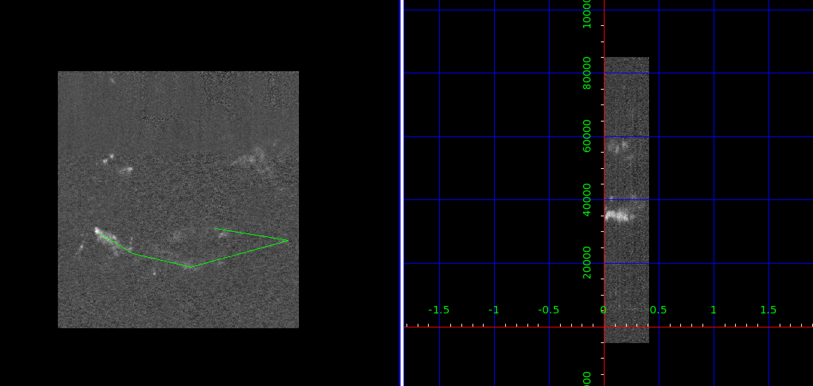

Position-Velocity Diagram Extractor
===================================
Full docs are available [here](http://pvextractor.readthedocs.org/en/latest/)

Tool to slice through data cubes and extract position-velocity (or other)
slices.

There are a few [utilities](pvextractor/utils) related to header trimming &
parsing.  Otherwise, there's one main function,
[pvextractor](pvextractor/pvextractor.py), that takes a data cube and a series of
points and returns a PV array.  It is based on scipy's `map_coordinates` but also
has .

For an example use case, see [this notebook]
(http://nbviewer.ipython.org/urls/raw.github.com/keflavich/pvextractor/master/examples/IRAS05358Slicing.ipynb)
(for a permanent, compiled version, look [here](examples/IRAS05358Slicing.html))

Minimal Install Instructions
----------------------------

    pip install https://github.com/ericmandel/pyds9/archive/master.zip
    pip install https://github.com/radio-astro-tools/spectral-cube/archive/master.zip
    pip install https://github.com/radio-astro-tools/pvextractor/archive/master.zip

The pvextractor GUI
-------------------

Run it like this:

    from pvextractor.gui import PVSlicer
    pv = PVSlicer('L1448_13CO.fits')
    pv.show()

Click to select "control points" along the path, then press "enter" to expand
the width of the slice, then click.  Optionally, "y" will show the exact
regions extracted.

Using pvextractor in ds9
------------------------

There is a python script that will be installed along with pvextractor.  You
can invoke it from the command line, but the preferred approach is to load the
tool into ds9.  First, determine the path to ``ds9_pvextract.ans``;
it is in [scripts/ds9_pvextract.ans](scripts/ds9_pvextract.ans).  Then start
up ds9 with the analysis tool loaded

    ds9 -analysis load /path/to/pvextractor/scripts/ds9_pvextract.ans  &

Then load any cube in ds9, draw a line, and press 'x' or press "PV Extractor"
in the menu.

Build and coverage status
=========================

