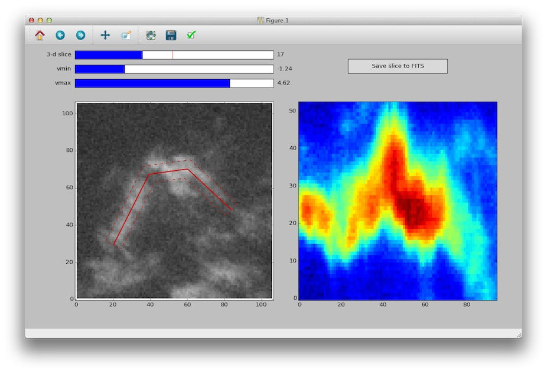

Using the built-in graphical user interface
===========================================

The extractor GUI provdes the most direct interface available to the
pixel-matched version of the position-velocity extractor.  It is simple to
initialize:

.. code-block:: python

    from pvextractor.gui import PVSlicer
    pv = PVSlicer('cube.fits')
    pv.show()

A window will pop up showing the data on the left hand side. Click to draw the vertices of the path, then press "enter" to expand
the width of the slice, then move your mouse away from the path to define how wide it should be. Once you are happy with the width, click, and the slice will be computed and shown on the right.

Once a path has been defined, you can optionally press "y" to see the polygons along which the data has been collapsed to compute the slice.

The following shows an example of a slice derived from a 13CO cube of L1448:

